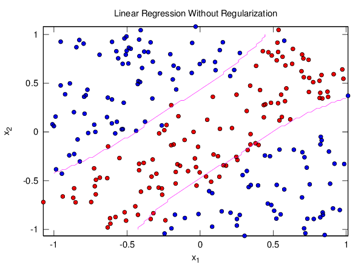
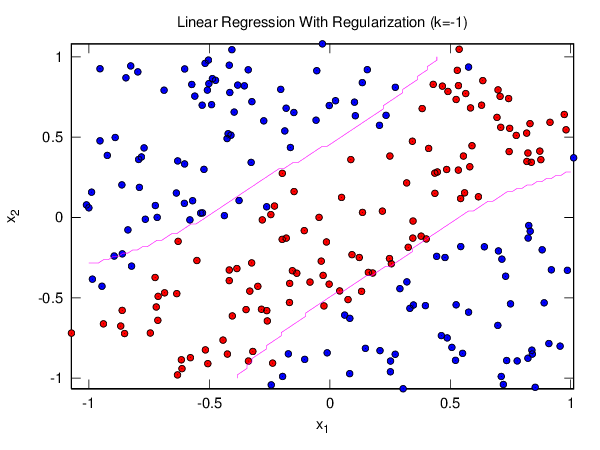
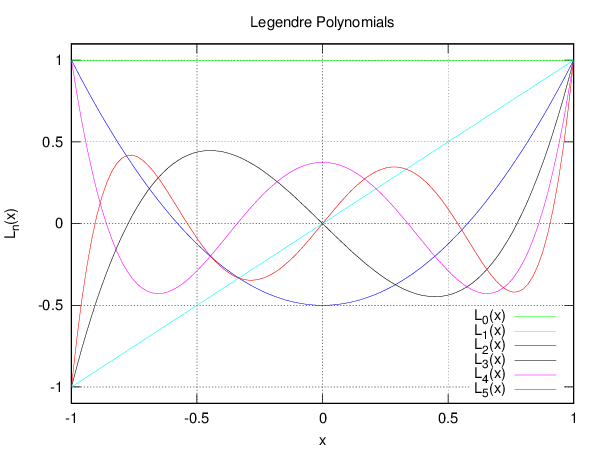

# Week 06

This week's homework was about deterministic/stochastic noise and neural
networks.

## Plots

### Linear Regression Without Regularization

This first figure shows the decision boundary found via Linear Regression,
without any regularization, plotted against a test set:

### Linear Regression With Regularization

This figure shows the decision boundary found via Linear Regression with
a regularization term, using the same training set as above and plotted
agains the same test set:

### Legendre Polynomials

This figure plots the Legendre Polynomials with degree ![legendre][legendre]:

[legendre]: http://latex.codecogs.com/gif.latex?d%3D%5B0%2C%205%5D
