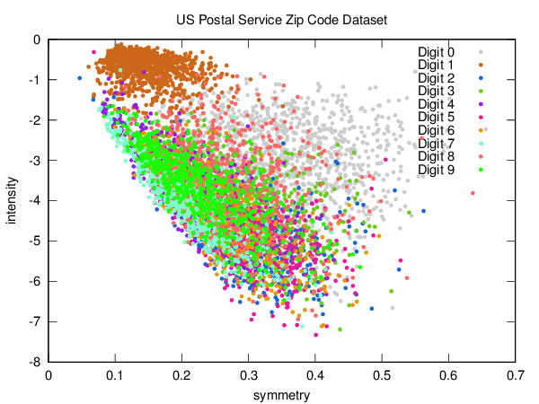
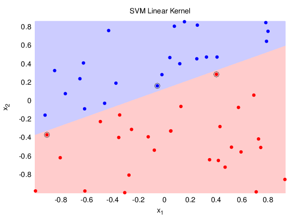
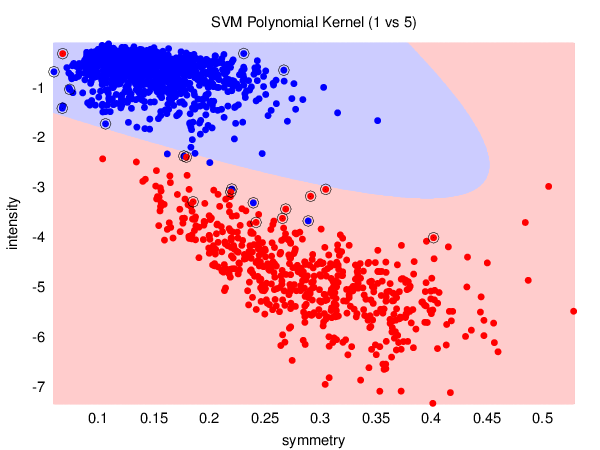
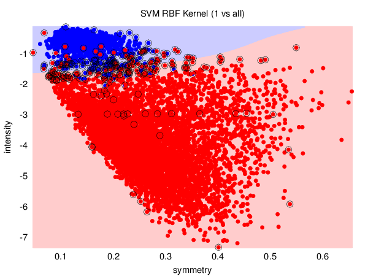

# Week #08

This week's homework was dedicated to SVMs (Support Vector Machines).

## Plots

### Dataset

The dataset used in the assignments is a processed version of the US Postal
Service Zip Code dataset, with extracted features of _symmetry_ and _intensity_.

### Linear SVM

In order to check whether [LIBSVM][libsvm] was set up correctly, this plot shows
the separating line along with the support vectors in a linearly separable
dataset generated randomly.

### N Vs M Classifier

This plot shows a hard-margin SVM with polynomial kernel (degree 2) that tries
to classify a digit as being '1' (positive) or '5' (negative).

### N Vs All Classifier

This plot shows a soft-margin (regularization parameter ![C=1][c1]) SVM with
RBF kernel that tries to classify a digit as being '1' (positive) or not being
'1' (negative).

[libsvm]: http://www.csie.ntu.edu.tw/~cjlin/libsvm/
[c1]: http://latex.codecogs.com/gif.latex?C%3D1
