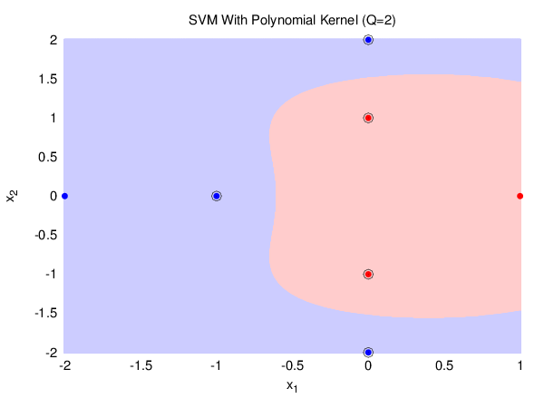
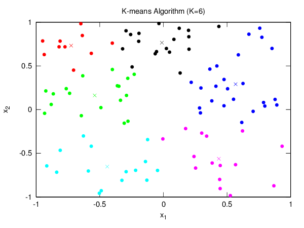
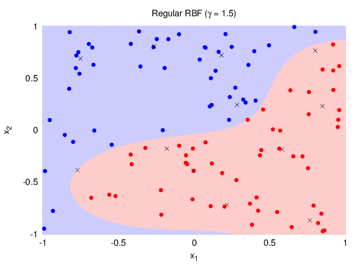
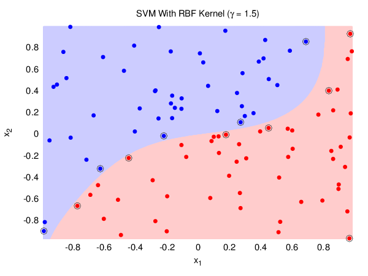

# Weeks #9 and #10

The final exam for the course covers almost everything that has been covered in
the lectures, and it is twice as long as the previous assignments.

## Plots

### SVM Geometry Question

Question 11 proposes a set of 6 points and asks what ![w][w] and ![b][b] separates
those points in the ![Z][Z] space.

Question 12 asks how many support vectors you would get if you want to separate
those points in the ![X][X] space by a polynomial kernel of degree ![Q=2][Q2].

### K-Means Clustering

In order to implement the regular form of RBF, the first requirement is to
implement the K-means algorithm, which is an unsupervised learning algorithm for
clustering.

The following figure shows how a dataset with 100 points was clustered, and what
the centroids for each cluster were.

### Radial Basis Functions (RBF)

This figure shows how the regular form of RBF would separate the points
generated by a slightly nonlinear target function. The centroids for each
cluster are denoted by the "x" markers.

For comparison, the next figure shows how SVM with the RBF kernel would separate
another set of points generated by the same target function as before.

[w]: http://latex.codecogs.com/gif.latex?w
[b]: http://latex.codecogs.com/gif.latex?b
[X]: http://latex.codecogs.com/gif.latex?%5Cmathcal%7BX%7D
[Z]: http://latex.codecogs.com/gif.latex?%5Cmathcal%7BZ%7D
[Q2]: http://latex.codecogs.com/gif.latex?Q%3D2
