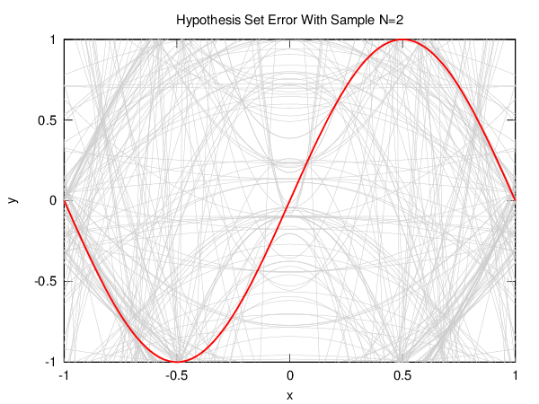
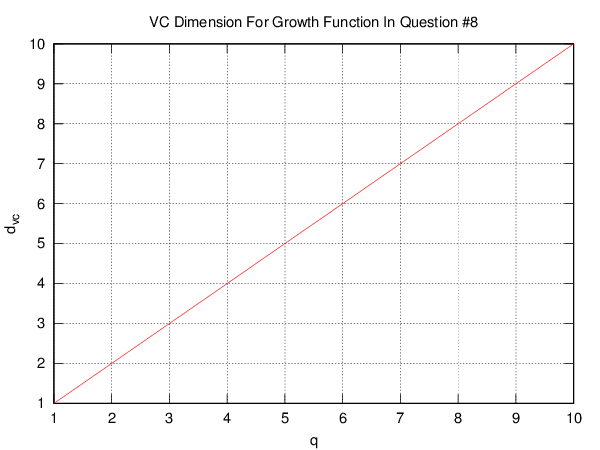

# Week #4

This week's homework was about bounds on generalization error and the
[bias-variance tradeoff][biasvar].

## Plots

### Generalization Error Bounds

This first figure shows the difference between four bounds on generalization
error:

### Bias/Variance Tradeoff

In this homework, we are asked to compare the expected generalization error of
five different hypothesis sets on a very limited sample of ![N=2][N2] examples.

![h(x)=b][hconst]

![h(x)=ax][hline1]

![h(x)=ax+b][hline2]

![h(x)=x^2][hcurve1]

![h(x)=x^2+b][hcurve2]

### VC Dimension vs Growth Function

In question #8, we are given a growth function and are asked to come up with a
term that defines its VC dimension. The tricky part is that the growth function
is recursive and depends on a parameter ![q][q].

This plot shows the dependency between ![q][q] and the VC dimension:

[biasvar]: http://scott.fortmann-roe.com/docs/BiasVariance.html
[N2]: http://latex.codecogs.com/gif.latex?N%3D2
[hconst]: http://latex.codecogs.com/gif.latex?h%28x%29%3Db
[hline1]: http://latex.codecogs.com/gif.latex?h%28x%29%3Dax
[hline2]: http://latex.codecogs.com/gif.latex?h%28x%29%3Dax%2Bb
[hcurve1]: http://latex.codecogs.com/gif.latex?h%28x%29%3Dax%5E2
[hcurve2]: http://latex.codecogs.com/gif.latex?h%28x%29%3Dax%5E2%2Bb
[q]: http://latex.codecogs.com/gif.latex?q
